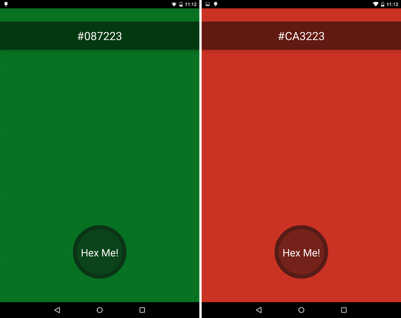

#Hex Me!
An Android app that generates a random color with the push of a button. The app will display the color in the background and provide the color in hex (RGB) format. The unique button was provided by [Markus Hi's 'Circle Button.'](https://github.com/markushi/android-circlebutton)Here are some screenshots taken with the 2013 Nexus 7: 
